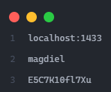

<h3>Sistema Fivani</h3>

<h3>Desarrollado en</h3>
Java  
SQL Server  
<h3>Ejecucion</h3>
El archivo a ejecutar para la base de datos para el sistema se encuentra en la ruta: src/com/databases/bdPuntoVenta.sql   
El Jar necesario para ejecutar el sistema se llama: Punto-de-Venta.jar   
Ademas este Jar requiere un archivo de texto llamado: CredencialesSQL.txt   
En este archivo de texto se deben escribir las credenciales de inicio de sesion para SQL Server, de la siguiente manera:   
1 - Direccion ip : puerto  
2 - Usuario  
3 - Contraseña   
Ejemplo:   
  
Una vez ejecutada la base de datos en SQL Server, creado el archivo con credenciales (Debe estar en la misma ruta del Jar), ya se puede ejecutar el sistema desde el Jar para ser utilizado.
<h3>Informacion</h3>
La clase principal para ejecutar el sistema se encuentra en la ruta:  
src/com/classes/PuntoDeVenta.java  
